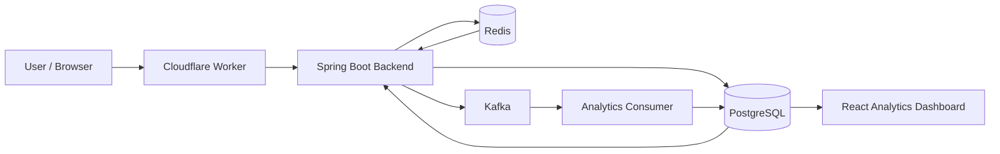
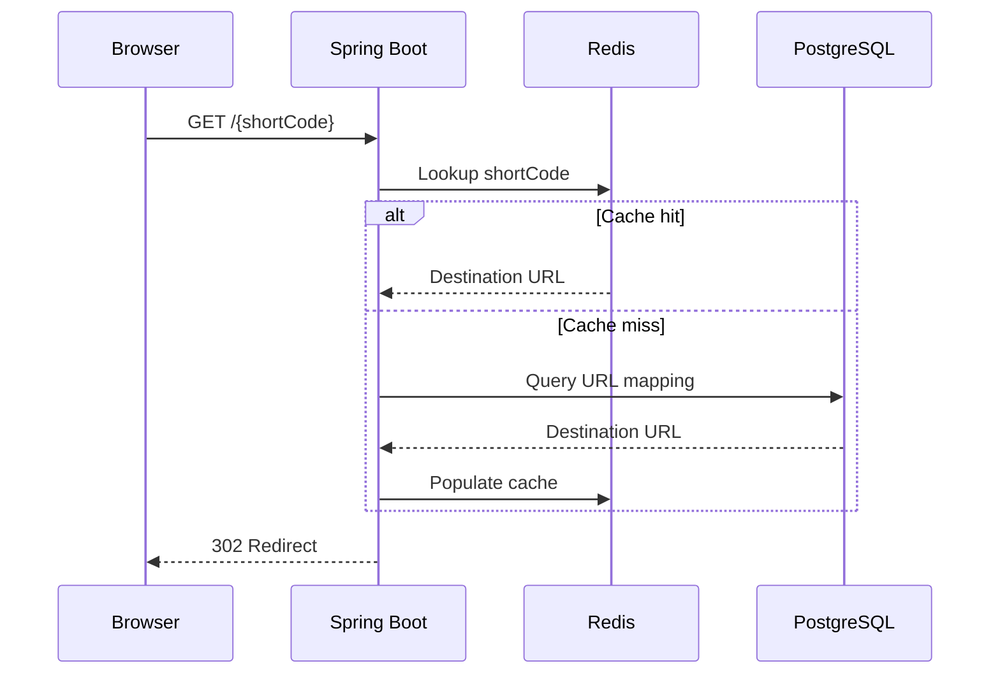
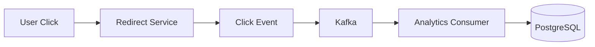
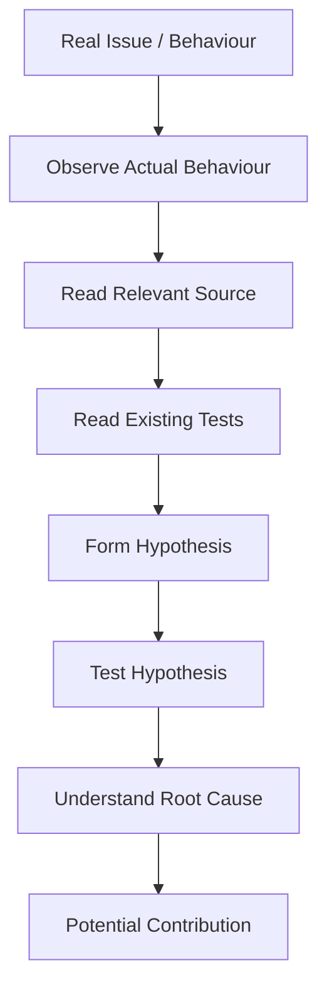
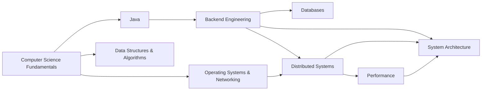

# Ibrahim Shaik

### Problem Solver · Fundamental Engineer · Software Engineering · Java Backend Engineer · Performance Engineering

> **I want to solve meaningful, complex, and useful problems by understanding fundamental truths from first principles, identifying real user pain, and building solutions that create measurable value.**

I see **computer science and technology as tools for solving problems**.

I am interested in understanding problems deeply, reducing them to their fundamental constraints, designing systems around those constraints, and validating whether the resulting solution actually works.

This GitHub profile is my **engineering record**.

Not a collection of technologies.

Not a list of buzzwords.

A record of:

**problems → reasoning → designs → implementations → failures → measurements → lessons**

---

## Navigation

- [Who I Am](#who-i-am)
- [How I Think](#how-i-think)
- [What Meaningful, Complex & Useful Means](#what-meaningful-complex--useful-means)
- [Evidence Behind My Engineering](#evidence-behind-my-engineering)
- [Featured Engineering Work](#featured-engineering-work)
- [Trimly](#trimly)
- [Performance Engineering](#performance-engineering)
- [OpenJDK Investigation](#openjdk-investigation)
- [My Engineering Method](#my-engineering-method)
- [What I'm Learning](#what-im-learning)
- [Technology](#technology)
- [Engineering Principles](#engineering-principles)
- [Current Direction](#current-direction)
- [Connect](#connect)

---

# Who I Am

I currently describe my engineering direction through five connected ideas:

### Problem Solver

I start with the problem rather than the technology.

### First-Principles Engineer

I try to understand what is fundamentally true before choosing an implementation.

### Software Architect & Engineer

I think about how components, data, APIs, storage, security, performance, and failure modes fit together — and then implement those designs.

### Java Backend Engineer

Java is currently my primary backend engineering direction, particularly around:

- Core Java
- Spring Boot
- REST APIs
- PostgreSQL
- Redis
- Kafka
- Authentication
- Backend architecture

### Performance Engineer / Architect

I am interested in understanding where time is actually spent in a system, measuring it, identifying bottlenecks, and improving the critical path rather than assuming that an optimisation will help.

These are not titles I use simply because they sound impressive.

I want the repositories here to provide the evidence.

---

# How I Think

My starting point is simple:

> **Don't start with the technology. Start with the problem.**

When I encounter a problem, I try to reason through:

                 REAL PROBLEM
                      │
                      ▼
              Who has the problem?
                      │
                      ▼
              What do they need?
                      │
                      ▼
              What is the gap?
                      │
                      ▼
             What are the constraints?
                      │
                      ▼
            What is fundamentally true?
                      │
                      ▼
             What assumptions exist?
                      │
                      ▼
              What are the options?
                      │
                      ▼
        What is the simplest effective solution?
                      │
                      ▼
                 BUILD IT
                      │
                      ▼
                 TEST IT
                      │
                      ▼
                MEASURE IT
                      │
                      ▼
              FIND THE BOTTLENECK
                      │
                      ▼
                  IMPROVE
````

The goal is not to make a system complicated.

The goal is to make the system **correct, understandable, useful, and effective for the problem it is solving**.

---

# What Meaningful, Complex & Useful Means

For me, these words are not just adjectives.

They describe how I decide whether a problem is worth spending engineering effort on.

## 1. Meaningful

I focus on problems that actually matter to someone.

A technically impressive system is not automatically meaningful.

The first question is:

> **Who benefits if this problem is solved?**

---

## 2. Complex

I am interested in problems that require genuine reasoning.

Complexity does not necessarily mean thousands of lines of code.

A problem can be difficult because of:

* conflicting requirements
* performance constraints
* reliability requirements
* data consistency
* security boundaries
* concurrency
* distributed processing
* failure modes
* limited resources

I want to understand **why** the complexity exists before trying to hide it behind abstractions.

---

## 3. Useful

A solution should produce a real benefit.

That benefit might be:

* reducing latency
* reducing repeated work
* improving reliability
* simplifying a workflow
* reducing operational complexity
* protecting data
* improving developer experience
* making information easier to access

The implementation is only valuable if it improves something that matters.

---

## 4. User Pain

I prefer starting from a real problem rather than:

"I learned technology X."
        ↓
"What can I build with it?"

Instead:

"There is a problem."
        ↓
"Why does it exist?"
        ↓
"What does the user actually need?"
        ↓
"What constraints exist?"
        ↓
"Could technology help?"

Technology is a tool.

The problem comes first.

---

## 5. First Principles

I try to strip away unnecessary assumptions.

For example, instead of saying:

> "Redis makes applications faster."

I ask:

Why is the application slow?

        ↓

What operation is expensive?

        ↓

Is the same data being requested repeatedly?

        ↓

Can that work be avoided?

        ↓

What are the consistency requirements?

        ↓

Would caching actually help?

        ↓

Where should the cache exist?

        ↓

What happens when the cache is unavailable?


The technology comes **after the reasoning**.

---

## 6. Build + Test

I don't want ideas to remain ideas.

The cycle I want to follow is:

Idea
 ↓
Hypothesis
 ↓
Implementation
 ↓
Test
 ↓
Measurement
 ↓
Failure
 ↓
Investigation
 ↓
Improvement
```

A solution that sounds correct is not enough.

I want evidence.

---

# Evidence Behind My Engineering

My engineering identity is based on things I have actually worked on.

| Engineering claim         | Evidence                                                                  |
| ------------------------- | ------------------------------------------------------------------------- |
| Problem solving           | DSA practice + debugging + Trimly engineering problems                    |
| First-principles thinking | Architecture decisions, investigation workflow, OpenJDK exploration       |
| Software architecture     | Trimly layered backend and separate redirect/analytics flows              |
| Java backend engineering  | Java + Spring Boot backend implementation                                 |
| Database engineering      | PostgreSQL schema, queries, ownership and indexing                        |
| Caching                   | Redis-based URL resolution                                                |
| Event-driven systems      | Kafka-based analytics processing                                          |
| Performance engineering   | Redirect and backend latency measurements                                 |
| Security engineering      | JWT, BCrypt, authentication, ownership isolation, rate limiting           |
| Systems investigation     | OpenJDK source-code and JTReg investigation                               |
| Deployment engineering    | Cloudflare, Render, Neon, Upstash, Aiven and Docker-based deployment work |

The purpose of this table is not to claim expertise in everything listed.

It is to show **where the engineering ideas have been exercised in actual work**.

---

# Featured Engineering Work

## 01 — Trimly

### URL Shortening + Link Analytics Platform

**Repository:**
[github.com/ibrahimBytes/trimly](https://github.com/ibrahimBytes/trimly)

Trimly started from a simple problem:

> **How can a long URL be represented by a short, manageable link while supporting ownership, authentication, analytics, caching, and reliable redirects?**

The interesting engineering problems appeared after the basic URL-shortening feature.

---

## The Problem

At the simplest level:

```text
Long URL
   ↓
Short Code
   ↓
User clicks short URL
   ↓
Redirect to destination
```

But a useful service also needs to answer:

* Who owns this URL?
* Can users create custom aliases?
* Should links expire?
* How is authentication handled?
* How can frequently accessed URLs be resolved quickly?
* How should click analytics be processed?
* How do we protect the redirect path?
* What happens when infrastructure components fail?
* How can the system be measured?

The project became an exploration of those engineering questions.

---

# Trimly Architecture



---

# Redirect Path

The redirect path is the latency-sensitive part of the system.



The reasoning is straightforward:

> **URL resolution is on the user's critical path, so unnecessary database work should be avoided where caching is appropriate.**

---

# Analytics Path

Analytics has a different requirement.

It does not need to perform all of its processing directly inside the redirect operation.



The engineering principle is:

> **Separate responsibilities when their performance and processing requirements are different.**

---

# Why Redis?

The fundamental problem:

> Repeatedly querying persistent storage for frequently accessed URL mappings can add unnecessary work to the redirect path.

Therefore:

```text
Request
   ↓
Redis lookup
   ↓
Cache hit?
 ┌───────┴───────┐
Yes              No
 │                │
 ▼                ▼
Redirect       PostgreSQL
                 │
                 ▼
              Redis
                 │
                 ▼
              Redirect
```

The trade-off:

> Caching improves access latency and can reduce database load, but introduces cache consistency and invalidation concerns.

---

# Why Kafka?

The fundamental observation was:

> Redirecting the user and processing analytics are different workloads.

Therefore:

```text
                 USER REQUEST
                      │
                      ▼
                Redirect Path
                      │
                      ├──────────► User gets redirect
                      │
                      ▼
                 Click Event
                      │
                      ▼
                    Kafka
                      │
                      ▼
              Analytics Consumer
                      │
                      ▼
                 PostgreSQL
```

Kafka provides an event-streaming boundary between the user-facing flow and analytics processing.

The trade-off is additional distributed-system complexity.

---

# Performance Evidence

I do not want to describe a system as "fast" without measuring it.

During Trimly testing, I measured the deployed redirect path.

Observed measurements included approximately:

| Metric           | Measurement |
| ---------------- | ----------: |
| Backend TTFB     |    ~0.345 s |
| Redirect minimum |    ~0.836 s |
| Redirect mean    |    ~1.086 s |
| Redirect p50     |    ~1.143 s |
| Redirect p95     |    ~1.324 s |
| Redirect p99     |    ~1.371 s |

These are measurements of the tested deployment and environment, not universal performance guarantees.

The important lesson was:

> **Measure first. Optimise second.**

---

<details>
<summary><strong>What I learned from Trimly</strong></summary>

The most valuable part of Trimly was not learning a list of technologies.

It was learning to reason about:

* critical paths
* caching
* persistence
* ownership
* authentication
* asynchronous processing
* database indexes
* failure modes
* deployment
* observability
* performance measurement
* security boundaries
* trade-offs

The project also showed me that adding a component is not automatically an improvement.

Every component introduces:

* operational cost
* failure modes
* debugging complexity
* consistency considerations
* maintenance requirements

Therefore, architecture should follow requirements rather than technology trends.

</details>

---

# 02 — OpenJDK Investigation

**Repository:**
[OpenJDK](https://github.com/openjdk/jdk)

I am exploring OpenJDK to understand Java beyond application-level programming.

My goal is to learn through the actual codebase, existing tests, real issues, and contribution workflow.

I am currently investigating areas around:

* Java API behaviour
* exception handling
* JDK implementation
* regression tests
* JTReg
* existing OpenJDK issues
* source-code investigation

My current process is:



I am intentionally careful about the distinction between:

* investigating an issue
* preparing a change
* submitting a change
* having a change reviewed
* having a change accepted

I currently describe my OpenJDK work as **investigation and contribution preparation**, not as a merged contribution.

---

# Performance Engineering

Performance is not simply:

> "Make the code faster."

The first question is:

> **Where is the time actually being spent?**

My current performance reasoning model is:

```text
User-perceived latency
        ↓
Measure
        ↓
Break down the request
        ↓
Identify expensive operation
        ↓
Find bottleneck
        ↓
Determine root cause
        ↓
Change one variable
        ↓
Measure again
        ↓
Compare
```

I am particularly interested in:

* latency
* throughput
* database query cost
* cache behaviour
* network overhead
* request critical paths
* memory usage
* concurrency
* system bottlenecks

I am still developing depth in this area.

My objective is to become capable of **explaining performance from underlying mechanisms rather than simply applying optimisation techniques**.

---

# My Engineering Method

I use a simple framework when approaching unfamiliar problems.

## 01 — Observe

What is actually happening?

## 02 — Define

What exactly are we trying to achieve?

## 03 — Identify the user

Who experiences the problem?

## 04 — Measure

What is the current state?

## 05 — Decompose

What are the components and interactions?

## 06 — Find constraints

What limits the possible solutions?

## 07 — Challenge assumptions

Which assumptions are facts?

Which are hypotheses?

Which are unnecessary?

## 08 — Generate solutions

What approaches are possible?

## 09 — Choose

What is the simplest solution that satisfies the actual requirements?

## 10 — Build

Turn the reasoning into working software.

## 11 — Test

Try to break the solution.

## 12 — Measure

Does reality match the expectation?

## 13 — Improve

Find the current bottleneck.

Then repeat.

---

# The Principle I Keep Coming Back To

> ### **Never optimise the solution before verifying that you are solving the right problem.**

A technically excellent solution to the wrong problem is still the wrong solution.

---

# What I'm Learning

My current development path is:



---

# Computer Science Foundations

I am strengthening:

* Data Structures & Algorithms
* Object-Oriented Programming
* Databases
* Operating Systems
* Computer Networks
* Concurrency
* System Design
* Distributed Systems

---

# Java

My current Java progression:

```text
Core Java
    ↓
OOP
    ↓
Collections
    ↓
Generics
    ↓
Exception Handling
    ↓
JDBC
    ↓
Spring Boot
    ↓
Backend Systems
    ↓
JVM / OpenJDK
```

The goal is not just to know APIs.

I want to understand the mechanisms behind them.

---

# Problem Solving

I practise DSA with the objective of becoming independent rather than memorising solutions.

My intended solving process is:

```text
Understand the problem
        ↓
Extract constraints
        ↓
Construct brute force
        ↓
Analyse complexity
        ↓
Identify bottleneck
        ↓
Find useful property
        ↓
Develop better approach
        ↓
Reason / prove
        ↓
Implement
        ↓
Test
        ↓
Analyse complexity
        ↓
Generalise
```

The real target is:

> **Unfamiliar problem → independent reasoning → working solution.**

---

# Technology

## Languages


---

## Backend


---

## Frontend


---

## Engineering Tools


---

# Engineering Principles

### Problem before technology

Technology is a means, not the starting point.

### Fundamentals before abstractions

Understand what the abstraction hides.

### Evidence before assumptions

Measure behaviour rather than guessing.

### Simplicity before unnecessary complexity

Every additional component should have a reason to exist.

### Correctness before optimisation

A fast incorrect system is still incorrect.

### Bottleneck before optimisation

Optimise the constraint that actually limits the system.

### Trade-offs before dogma

There is rarely a universally correct architecture.

### Honesty before impressive claims

I want this profile to reflect what I have actually built, investigated, tested, and learned.

---

# What I'm Working Towards

My long-term direction is not simply:

> "Learn more technologies."

It is:

```text
Understand Problems
        ↓
Reason from Fundamentals
        ↓
Design Systems
        ↓
Build Software
        ↓
Measure Behaviour
        ↓
Understand Failure
        ↓
Improve the System
        ↓
Solve More Difficult Problems
```

I want to become an engineer capable of moving between levels of abstraction:

```text
User Problem
     ↓
Product Requirement
     ↓
System Architecture
     ↓
Service Design
     ↓
API
     ↓
Data Model
     ↓
Algorithm
     ↓
Runtime
     ↓
Operating System
     ↓
Hardware
```

The deeper I understand the layers underneath a system, the better I can reason about the system as a whole.

---

# A Personal Engineering Thesis

> **Good engineering is not about using the most sophisticated technology.**
>
> **It is about understanding the problem deeply enough to know what sophistication is actually necessary.**

For me, that means:

**Meaningful**

→ solve something that matters.

**Complex**

→ engage with problems that require real reasoning.

**Useful**

→ produce measurable benefit.

**User pain**

→ start with the people and problem, not the technology.

**First principles**

→ understand the fundamental constraints.

**Build + test**

→ turn ideas into evidence.

And ultimately:

> ### **Find the simplest solution that solves the right problem.**

I want to develop this mindset because it should remain useful even as the technologies used to build software change.

Today's tools may change.

The fundamental questions remain:

> **What is the problem?**

> **What is actually true?**

> **What are the constraints?**

> **What is the simplest thing that could work?**

> **How do we know it works?**

---

# Current Status

### Building

* Java backend systems
* Trimly
* REST APIs
* Database-backed applications
* Redis-backed caching
* Kafka-based event processing
* React/TypeScript interfaces

### Investigating

* OpenJDK
* JDK source code
* JTReg
* JVM behaviour
* Performance bottlenecks
* System design trade-offs

### Strengthening

* DSA
* Core Java
* SQL
* Databases
* Operating Systems
* Networking
* Distributed systems
* Interview problem solving
* Technical communication

### Long-term

* Deeper JVM understanding
* Systems engineering
* Performance engineering
* Distributed systems
* Large-scale architecture
* Open-source contribution
* Meaningful technology-driven problem solving

---

# Connect

[](https://www.linkedin.com/in/ibrahim-shaik-1baa8a341/)

[](https://bsky.app/profile/s-ibrahim-dev.bsky.social)

[](https://instagram.com/ibrahim.kernal)

[](mailto:s.ibrahim.devx@gmail.com)

---

## Final Principle

```text
              PROBLEM
                 │
                 ▼
          FIRST PRINCIPLES
                 │
                 ▼
              DESIGN
                 │
                 ▼
               BUILD
                 │
                 ▼
                TEST
                 │
                 ▼
              MEASURE
                 │
                 ▼
              LEARN
                 │
                 ▼
              IMPROVE
                 │
                 └───────────────┐
                                 │
                                 ▼
                              REPEAT
```

> **Building better systems, one problem at a time.**

```

### Why this version is much closer to what you're trying to represent

The central story is now:

**Problem Solver → Fundamentals → Architecture → Engineering → Evidence.**

And the README repeatedly demonstrates that story instead of merely claiming it.

For example, **“Performance Architect”** is supported by the actual performance-measurement section; **“Software Architect”** is supported by the Trimly architecture and architectural trade-offs; **“Java Backend Engineer”** is supported by the actual Java/Spring/PostgreSQL/Redis/Kafka work; and **“First-Principles Engineer”** is demonstrated through the reasoning framework and OpenJDK investigation.

That distinction is important for your broader goal: **your GitHub should become evidence of the engineer you are becoming, rather than a declaration of the engineer you hope to become.**  
